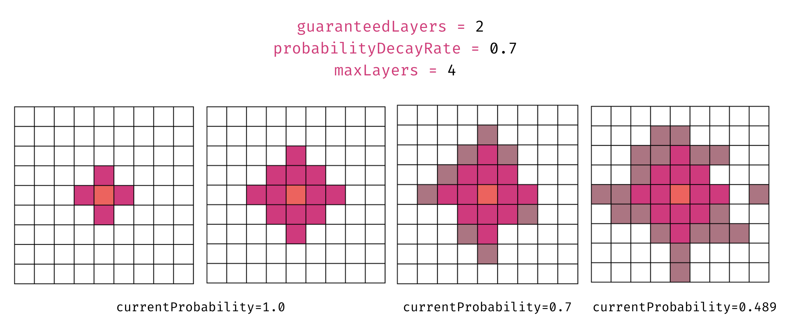

# Lónglíng (龙林) 🐉🌸
*"Lóng" (龙) means "dragon" in Chinese, and "Líng" (林) means "forest."*

Deep within the heart of *Lónglíng*, the mystic Dragon Forest, lies the fabled **Temple of Eternal Whispers**. Legends speak of an ancient sanctuary hidden among the dense trees, where the secrets of immortality and untold power are guarded by the forest's eternal protectors—dragons.  

The forest is alive, its paths twisting and turning into spirals that defy logic and reason. These spirals are no accident; they are the dragons' ancient magic, designed to disorient and confuse any who dare to enter. The spirals are said to represent the eternal cycle of life, death, and rebirth, a sacred pattern that mirrors the dragons' own mystical nature.  

As an adventurer, your quest is to uncover the entrance to the **Temple of Eternal Whispers**, but the journey will not be easy. The dragons will test your resolve, leading you deeper into the labyrinthine spirals of the forest. Each clearing you find may hold a clue—or a trap. The spirals are not just paths; they are trials, meant to separate the worthy from the unworthy.  

Will you navigate the enchanted spirals, outwit the dragons, and uncover the temple's secrets? Or will you become another lost soul, forever wandering the mystical paths of *Lónglíng*?  
# Acknowledgment

This project is heavily inspired by **Sebastian Lague’s** popular tutorial on **Cellular Automata**. His work provided the foundation for the scripts used in this level generator. You can watch the tutorial series here:  [**Sebastian Lague - Cellular Automata Tutorial**](https://www.youtube.com/watch?v=v7yyZZjF1z4&list=PLFt_AvWsXl0eZgMK_DT5_biRkWXftAOf9)

# Level Generator Overview ⚙️

The level generator for **Lónglíng** operates in three distinct stages to create a dense, mystical forest filled with spiraling paths, clearings, and hidden secrets. Below is a detailed breakdown of each stage.


---

## **Stage 1:** Initial Grid Generation

### Dense Forest Initialization 🌸
The map is initialized as a 2D grid where all cells are set to `1`, representing a dense forest. This ensures that the level starts as a completely filled forest, and clearings and paths are carved out during subsequent steps.

---
### Generating the Temple and Dragon Clearings ⛩️ 🐲
The level will feature a Temple clearing, the heart of the forest, several Dragon clearings and a clearing where the player should start. Dragons, being fiercely territorial, guard the temple with unwavering vigilance. Their ancient magic test the resolve of intruders, ensuring that only the most determined and worthy adventurers can uncover the secrets of the Temple of Eternal Whispers.

A **clearing** is generated using **Breadth-First Search (BFS)** to create a space for the **Temple of Eternal Whispers**. To prevent collisions between the clearings, the map was divided into a 5x5 grid. This ensures that when a clearing is placed, no other clearings are located in the 8 neighboring cells or in the same cell. This approach maintains proper spacing between clearings, creating a balanced and visually appealing layout. You can see an illustration of this concept in the figure below:


<div align="center">
  
</div>

---
### BFS Algorithm 
<div align="center">
  
</div>


  - Start from a randomly chosen point `clearingLocation` within the central region of the map (to avoid edges).
  - Use a queue to explore neighboring cells in all four cardinal directions (up, down, left, right).
  - Mark cells as empty (`0`) based on a **probability decay**:
    - Initially, the probability of clearing a cell is `100%`.
    - After a certain number of guaranteed layers, the probability decreases exponentially using a **decay rate** (e.g., `currentProbability *= probabilityDecayRate`).
  - This creates a natural-looking clearing that is larger in the center and tapers off toward the edges.
  - Stop when reaching a maximum number of layers `maxLayers`
  - These clearings are later **smoothed** in Stage 2 to make their shapes more organic and irregular.


**Temple Clearing Parameters ⛩️**

The number of guaranteed layers and maximum layers for the temple is increased to create a larger clearing, ensuring that the temple prefab has sufficient space and fits seamlessly within the environment and also stands out.
```
guaranteedLayers = 13
probabilityDecayRate = 0.9
maxLayers = 15
```
**Dragon Clearing Parameters 🐲**
```
guaranteedLayers = 8
probabilityDecayRate = 0.7
maxLayers = 15
```

**Player Clearing Parameters**
```
guaranteedLayers = 4
probabilityDecayRate = 0.7
maxLayers = 10
```

## Stage 2: Cellular Automata for Smoothing

The cellular automata algorithm is applied to smooth the clearings and make their shapes more irregular and natural-looking. This enhances the variety and realism of the level.

### Algorithm
- For each cell in the grid:
  - Count the number of neighboring cells that are walls (`1`).
  - Apply the following rules:
    - If a cell has more than 4 wall neighbors, it becomes a wall (`1`).
    - If a cell has fewer than 4 wall neighbors, it becomes empty (`0`).
- This process is repeated for a fixed number of iterations (e.g., 5) to achieve the desired smoothing effect.


---

## Stage 3: Connecting Spirals and Clearings

### Populating Map with Spirals 🌀
**Spirals** are generated using the **Euler Spiral formula**, starting from the temple clearing and dragon clearings.

The **Euler Spiral**, also known as the **Clothoid**, is a curve whose curvature increases linearly with its arc length. This property makes it ideal for generating smooth, natural-looking spirals. The mathematical formulation of the Euler Spiral is based on parametric equations:

#### **Mathematical Formulation**
The position `(x, y)` of a point on the Euler Spiral is given by:
```math
x(s) = \int_0^s \cos(\theta(t)) \, dt
y(s) = \int_0^s \sin(\theta(t)) \, dt
```
Where 
- `s` is the s is the arc length (distance along the curve).
- `θ(t)` is the angle of the tangent to the curve at distance t, defined as:
```math
\theta(t) = \theta_0 + k \cdot t
```
- `θ_0`: Initial angle (starting direction of the spiral).
- `k`: Curvature rate, which increases linearly with `t`.
In our implementation, we approximate this curve iteratively using small steps.

**Implementation**:
  - The curvature of the spiral increases linearly with distance, creating a smooth, natural curve.
  - The angle of the spiral is updated iteratively:
    ```csharp
    angle += direction * growthFactor * distance / 10f;
    ```
    - `direction`: Determines whether the spiral curves clockwise (`1`) or counterclockwise (`-1`).
    - `growthFactor`: Controls how quickly the curvature increases.
    - `distance`: Represents the distance from the starting point, incremented in each iteration.
  - The next position in the spiral is calculated as:
    ```csharp
    nextPos = currentPos + new Vector2(
        Mathf.Cos(angle) * stepSize,
        Mathf.Sin(angle) * stepSize
    );
    ```
    - `stepSize`: Determines the spacing between points in the spiral.
- **Parameters**:
  - **Starting Distance**: The initial distance from the center of the clearing.
  - **Growth Factor**: Controls the rate of curvature increase (e.g., `0.3f`).
  - **Step Size**: Controls the spacing between points (e.g., `0.5f`).
  - **Direction**: Randomly chosen for each spiral to create variety (clockwise or counterclockwise).
---

### Connect Clearings 🌉

The level generator connects all clearings using a **Minimum Spanning Tree (MST)** algorithm, ensuring every part of the forest is accessible while maintaining the mystical, maze-like quality.

#### Algorithm
- **Prim's Algorithm** is used to generate the MST:
  - Start with the temple clearing as the initial node.
  - For each unvisited clearing, calculate the Manhattan distance to all visited clearings.
  - Connect the closest unvisited clearing to a visited one with an S-shaped path.
  - Repeat until all clearings are connected.

#### S-Shaped Path Generation
- Paths between clearings follow natural, curved routes using cubic Bézier interpolation:
  - The path first attempts to use A* pathfinding to navigate around walls.
  - If A* fails, a fallback path with a midpoint offset creates a curved connection.
  - Control points are added along the path and interpolated with cubic Bézier curves:
    ```csharp
    Vector2 cp1 = p1 + dir1 * Vector2.Distance(p1, p2) * 0.5f;
    Vector2 cp2 = p2 - dir2 * Vector2.Distance(p1, p2) * 0.5f;
    ```
  - The `curviness` parameter (set to `0.9f`) controls how pronounced the curves are.
  - Paths have variable thickness (`pathThickness = 1`) to create natural-looking trails.

### Place Trees 🌲

Trees are placed on all wall cells `map[x, y] != 0` to create a dense, mystical atmosphere while ensuring paths remain navigable.

Three different tree prefabs are used for visual variety (`Tree1`, `Tree2`, `Tree3`).Each tree is randomly scaled between `0.05f` and `0.2f` to create natural variation.

### Place Other Objects 🏯

The final step places the temple, dragons, and player in their respective clearings, bringing the mystical forest to life. Each object is properly scaled and positioned to maintain the visual harmony of the scene. Finally, when the map is regenerated (by clicking), all objects are cleared and placed anew.

#### Object Placement
- **Temple Placement**: The Temple of Eternal Whispers is placed at the first clearing location:
  ```csharp
  temple = PlacePrefab(templePrefab, clearingLocations[0], "Temple");
  ```

- **Dragon Placement**: Four unique dragons guard their territories throughout the forest:
  ```csharp
  for (int i = 1; i <= 4; i++)
  {
      GameObject dragon = PlacePrefab(dragonPrefabs[i - 1], clearingLocations[i], $"Dragon{i}");
      dragon.transform.localScale = dragonScale;
      dragons.Add(dragon);
      AddDragonBehavior(dragon, clearingLocations[i]);
  }
  ```
  
- **Dragon Behavior**: Each dragon is assigned a behavior tree using [NPBehave](https://github.com/meniku/NPBehave):
  - Dragons move around their clearing at a defined speed (`dragonMoveSpeed = 0.5f`).
  - Movement is restricted to adjacent empty cells to prevent dragons from leaving their territory.
  - The behavior tree operates in a loop: Wait → Move → Repeat.

- **Player Placement**: The player's starting position is set at the last clearing:
  ```csharp
  player = PlacePrefab(playerPrefab, clearingLocations[^1], "Player");
  ```

- 


---
