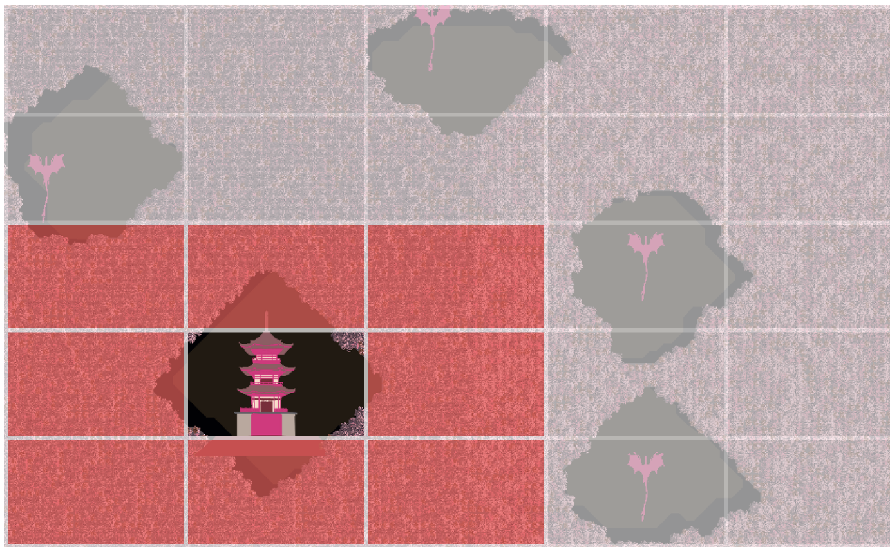

# Lónglíng (龙林) 🐉🌸
*"Lóng" (龙) means "dragon" in Chinese, and "Líng" (林) means "forest."*

Deep within the heart of *Lónglíng*, the mystic Dragon Forest, lies the fabled **Temple of Eternal Whispers**. Legends speak of an ancient sanctuary hidden among the dense trees, where the secrets of immortality and untold power are guarded by the forest's eternal protectors—dragons.  

The forest is alive, its paths twisting and turning into spirals that defy logic and reason. These spirals are no accident; they are the dragons' ancient magic, designed to disorient and confuse any who dare to enter. The spirals are said to represent the eternal cycle of life, death, and rebirth, a sacred pattern that mirrors the dragons' own mystical nature.  

As an adventurer, your quest is to uncover the entrance to the **Temple of Eternal Whispers**, but the journey will not be easy. The dragons will test your resolve, leading you deeper into the labyrinthine spirals of the forest. Each clearing you find may hold a clue—or a trap. The spirals are not just paths; they are trials, meant to separate the worthy from the unworthy.  

Will you navigate the enchanted spirals, outwit the dragons, and uncover the temple's secrets? Or will you become another lost soul, forever wandering the mystical paths of *Lónglíng*?  

# Level Generator Overview ⚙️

The level generator for **Lónglíng** operates in three distinct stages to create a dense, mystical forest filled with spiraling paths, clearings, and hidden secrets. Below is a detailed breakdown of each stage:

---

## **Stage 1:** Initial Grid Generation

### Dense Forest Initialization 🌸
- The map is initialized as a 2D grid where all cells are set to `1`, representing a dense forest.
- This ensures that the level starts as a completely filled forest, and clearings and paths are carved out during subsequent steps.

### Generating the Temple and Dragon Clearings ⛩️ 🐲
The level will feature a Temple clearing, the heart of the forest, and several Dragon clearings. Dragons, being fiercely territorial, guard the temple with unwavering vigilance. Their ancient magic test the resolve of intruders, ensuring that only the most determined and worthy adventurers can uncover the secrets of the Temple of Eternal Whispers.

A **clearing** is generated using **Breadth-First Search (BFS)** to create a space for the **Temple of Eternal Whispers**. To prevent collisions between the clearings, the map was divided into a 5x5 grid. This ensures that when a clearing is placed, no other clearings are located in the 8 neighboring cells or in the same cell. This approach maintains proper spacing between clearings, creating a balanced and visually appealing layout. You can see an illustration of this concept in the figure below:



- **BFS Algorithm**:
  - Start from a randomly chosen point (`clearingLocation`) within the central region of the map (to avoid edges).
  - Use a queue to explore neighboring cells in all four cardinal directions (up, down, left, right).
  - Mark cells as empty (`0`) based on a **probability decay**:
    - Initially, the probability of clearing a cell is `100%`.
    - After a certain number of guaranteed layers, the probability decreases exponentially using a **decay rate** (e.g., `currentProbability *= probabilityDecayRate`).
  - This creates a natural-looking clearing that is larger in the center and tapers off toward the edges.

### 1.3 Generating Dragon Clearings 🐲
- Additional clearings are generated for the dragons, separate from the temple clearing.
- Each dragon clearing is created using a similar BFS approach but with smaller sizes and random starting points.
- These clearings are later **smoothed** in Stage 2 to make their shapes more organic and irregular.

### 1.4 Generating Spirals
- **Spirals** are generated using the **Euler Spiral formula**, starting from the temple clearing and dragon clearings.
- **Euler Spiral Formula**:
  - The curvature of the spiral increases linearly with distance, creating a smooth, natural curve.
  - The angle of the spiral is updated iteratively:
    ```csharp
    angle += direction * growthFactor * distance / 10f;
    ```
    - `direction`: Determines whether the spiral curves clockwise (`1`) or counterclockwise (`-1`).
    - `growthFactor`: Controls how quickly the curvature increases.
    - `distance`: Represents the distance from the starting point, incremented in each iteration.
  - The next position in the spiral is calculated as:
    ```csharp
    nextPos = currentPos + new Vector2(
        Mathf.Cos(angle) * stepSize,
        Mathf.Sin(angle) * stepSize
    );
    ```
    - `stepSize`: Determines the spacing between points in the spiral.
- **Parameters**:
  - **Starting Distance**: The initial distance from the center of the clearing.
  - **Growth Factor**: Controls the rate of curvature increase (e.g., `0.3f`).
  - **Step Size**: Controls the spacing between points (e.g., `0.5f`).
  - **Direction**: Randomly chosen for each spiral to create variety (clockwise or counterclockwise).
- Spirals are generated from:
  - The **temple clearing**, creating paths leading to the temple.
  - The **dragon clearings**, creating paths that connect to the dragons' locations.

---

#### **Euler Spiral Overview**
The **Euler Spiral**, also known as the **Clothoid**, is a curve whose curvature increases linearly with its arc length. This property makes it ideal for generating smooth, natural-looking spirals. The mathematical formulation of the Euler Spiral is based on parametric equations:

#### **Mathematical Formulation**
The position `(x, y)` of a point on the Euler Spiral is given by:
```math
x(s) = \int_0^s \cos(\theta(t)) \, dt
y(s) = \int_0^s \sin(\theta(t)) \, dt
```
Where 
- `s` is the s is the arc length (distance along the curve).
- `θ(t)` is the angle of the tangent to the curve at distance t, defined as:
```math
\theta(t) = \theta_0 + k \cdot t
```
- `θ_0`: Initial angle (starting direction of the spiral).
- `k`: Curvature rate, which increases linearly with `t`.
In our implementation, we approximate this curve iteratively using small steps.

## Stage 2: Cellular Automata for Smoothing

### Purpose
- The cellular automata algorithm is applied to **smooth the dragon clearings** and make their shapes more irregular and natural-looking.
- This enhances the variety and realism of the level.

### Algorithm
- For each cell in the grid:
  - Count the number of neighboring cells that are walls (`1`).
  - Apply the following rules:
    - If a cell has more than 4 wall neighbors, it becomes a wall (`1`).
    - If a cell has fewer than 4 wall neighbors, it becomes empty (`0`).
- This process is repeated for a fixed number of iterations (e.g., 5) to achieve the desired smoothing effect.

---

## Stage 3: Connecting Spirals and Clearings

### Purpose
- This stage focuses on connecting the spirals and clearings to ensure the level is playable.
- The goal is to create a network of paths that guide the player through the forest while maintaining the mystical and challenging nature of the environment.

### Implementation (To Be Written)
- Details of this stage will be added later as it has not yet been implemented.

---

## Summary
The level generator for **Mílóng Sēnlín** creates a dense, magical forest with spiraling paths and clearings through the following stages:
1. **Stage 1**: Initializes the map, generates clearings for the temple and dragons, and creates spirals using the Euler Spiral formula.
2. **Stage 2**: Applies cellular automata to smooth the dragon clearings and enhance variety.
3. **Stage 3**: (To Be Written) Connects the spirals and clearings to ensure a cohesive and playable level.

This approach ensures that the level is both visually appealing and challenging, immersing the player in the mystical world of **Lónglíng**.